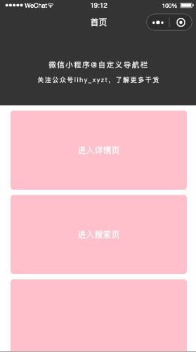

# 参数

| 属性            | 描述                         | 默认值     |
| --------------- | ---------------------------- | ---------- |
| showCapsule     | 是否显示左侧胶囊按钮         | false      |
| capsuleStyle    | 胶囊按钮风格：white / black  | white      |
| showHomeButton  | 实现显示前往首页按钮         | true       |
| title           | 标题                         | '默认标题' |
| titleViewStyle  | 标题栏风格：default / custom | default    |
| leftStyle       | 左侧内容：default / custom   | custom     |
| tintColor       | 前景色                       | \#373737   |
| backgroundColor | 背景色                       | \#eeeeee   |
| gradientColor   | 渐变导航状态下的背景色       | ' '        |

> 提示：
>
> - 渐变导航需指定 `gradientColor` 颜色，然后在页面中监听页面滚动并调用组件的 `setOpacity` 方法。
>
>   ```js
>   Page({
>     onLoad() {
>       // appHeader
>       this.appHeader = this.selectComponent('#app-header');
>     },
>     onPageScroll({ scrollTop }) {
>       this.appHeader.setOpacity(scrollTop);
>     }
>   })
>   ```

# 方法

- `setOpacity(scrollTop: number)`：设置渐变导航

# 插槽

## 1. #left

自定义标题左侧内容，需设置`leftStyle` 为`custom`。